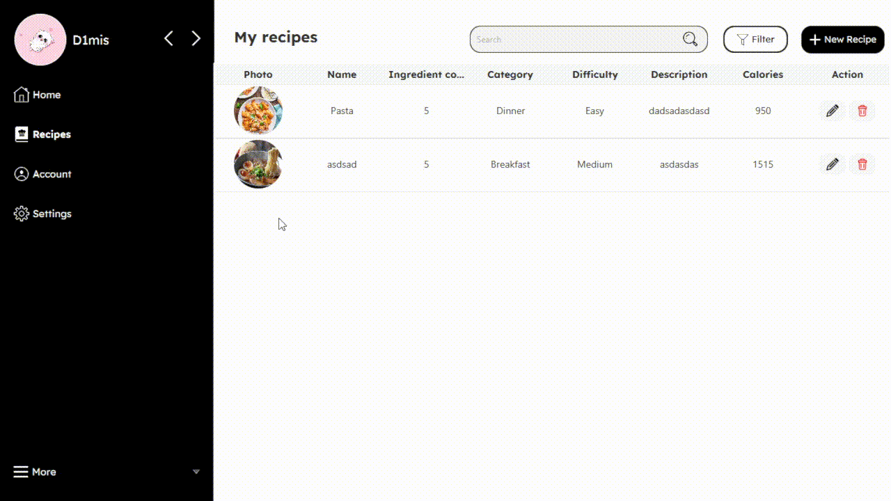
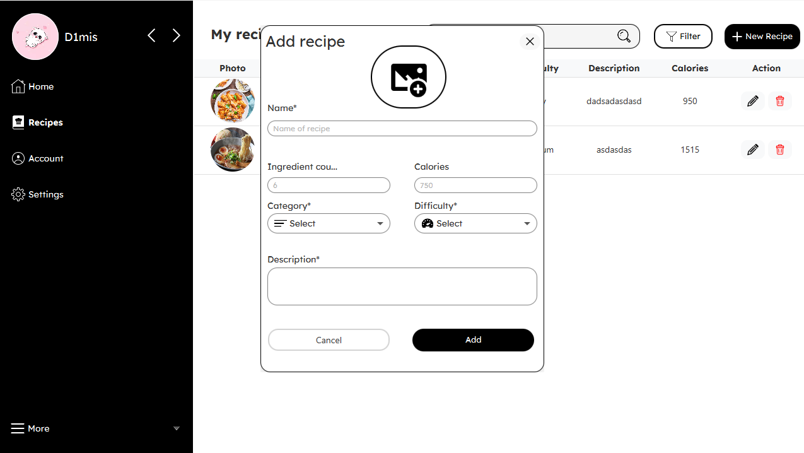
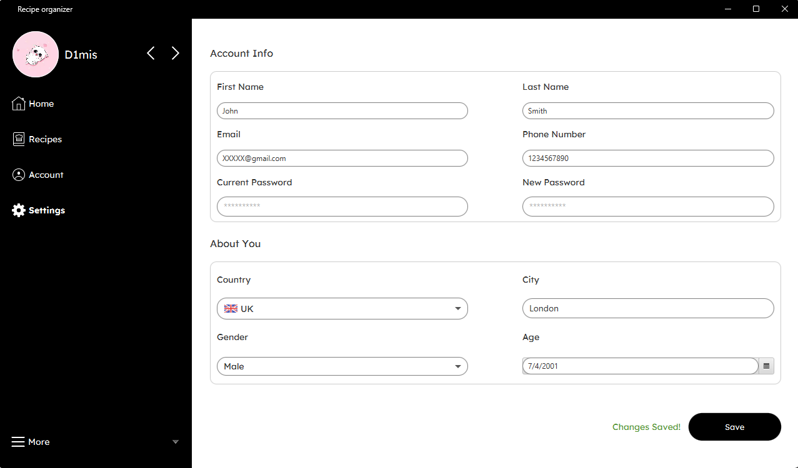

🧾 **Recipe-Management-Desktop-App**
A desktop application for creating, managing, and organizing personal recipes with multi-user support.

Built as a university project to demonstrate full-stack Java desktop development skills: **JavaFX**,**CSS** and **SceneBuilder** for GUI, **MySQL** database integration, **CRUD** operations, user authentication, and personalized data handling.

⭐ **Features**
- **User Accounts** — Registration, login, session management
- **Personalized Profiles** — Each user has their own private recipe collection
- **Recipe CRUD** — Create, read, update, delete recipes with full database support
- **Search & Filter** — Find recipes by title, ingredients, category, etc.
- **Modern GUI** — Responsive interface built with JavaFX + Scene Builder + CSS
- **Database Backend** — MySQL for persistent storage
Desktop Recipe Management App built with Java, JavaFX, Scene Builder, CSS, and MySQL – full CRUD, multi-user accounts, authentication, and personalized profiles.
  
  
 

🧰 **Technologies Used**
- **Java**
- **JavaFX** (for UI)
- **Scene Builder** (for FXML layout design)
- **CSS** (styling)
- **MySQL** + **JDBC** (database connectivity)
